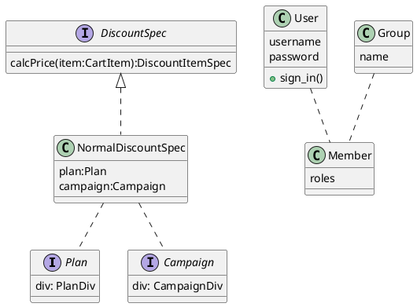

### a

Plan
| uname | label | note |
| :-------- | :---------: | --------: |
| bronze | ブロンズ| |
| gold | ゴールド | |

Campaign
| uname | label | start | end |
| :--- | :---: | ---: | :---: |
| bronze | ブロンズ| |
| gold | ゴールド | |
